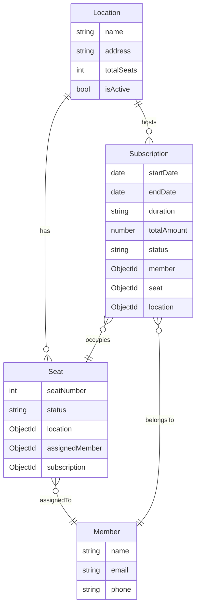

# Multi-Location Support Plan

## Current State
- Single location system (default building with 46 seats)
- [`LocationManagement`](src/components/LocationManagement.tsx:1) component exists but has no backend API
- All seats are global (no location association)
- All subscriptions are global (no location filtering)

## Goal
Enable management of multiple facilities, each with its own seats and members

---

## Phase 1: Backend Data Models

### 1.1 Create Location Model
```typescript
// src/models/Location.ts
- _id
- name (e.g., "Building A", "Building B")
- address
- totalSeats
- isActive
```

### 1.2 Update Existing Models

**Seat Model** - Add location reference:
```typescript
location: { type: mongoose.Schema.Types.ObjectId, ref: 'Location' }
```

**Subscription Model** - Add location reference:
```typescript
location: { type: mongoose.Schema.Types.ObjectId, ref: 'Location' }
```

**Member Model** - Optional: Add default location or allow multi-location membership
```typescript
// Option A: Single location per member
defaultLocation: { type: mongoose.Schema.Types.ObjectId, ref: 'Location' }

// Option B: Allow member at multiple locations (subscription-based, current approach)
```

---

## Phase 2: API Routes

### 2.1 Locations API
- `GET /api/locations` - List all locations
- `POST /api/locations` - Create location
- `PUT /api/locations/[id]` - Update location
- `DELETE /api/locations/[id]` - Delete location

### 2.2 Update Seats API
- Add location filter to GET `/api/seats`
- Require location when creating subscriptions

### 2.3 Update Subscriptions API
- Add location filter to GET `/api/subscriptions`
- Require location when creating subscriptions

### 2.4 Update Init API
- Create seats for a specific location instead of global

---

## Phase 3: Frontend Components

### 3.1 Location Management Page
- Already exists: [`LocationManagement.tsx`](src/components/LocationManagement.tsx:1)
- Needs API integration

### 3.2 Seats Page Updates
- Add location selector filter
- Show seats by location
- Allow seat creation per location

### 3.3 Subscription Management Updates
- Add location selector in filters
- Require location selection when creating subscription

### 3.4 Dashboard Updates
- Show stats per location
- Allow location switching

---

## Phase 4: Data Migration

### 4.1 Migrate Existing Data
- Create default "Main Building" location
- Assign all existing seats to this location
- Assign all existing subscriptions to this location

### 4.2 Migration Script
```typescript
// Script to run once
1. Create default location document
2. Update all seats with location_id
3. Update all subscriptions with location_id
```

---

## Phase 5: New Location Setup Flow

### 5.1 Create Location
- Admin creates new location with seat count

### 5.2 Initialize Seats
- Auto-generate seats for new location
- Or manually add seats one by one

### 5.3 Assign Members
- Members can subscribe to multiple locations
- Each location has independent seat availability

---

## User Stories

| As a... | I want to... | So that... |
|---------|--------------|------------|
| Admin | Create new locations | I can manage multiple facilities |
| Admin | Set seat capacity per location | Each facility has proper capacity |
| Admin | View reports per location | I can analyze each facility separately |
| Member | Subscribe to any location | I can choose my preferred facility |
| Member | See available seats at my location | I know if space is available |

---

## Mermaid: Data Model


